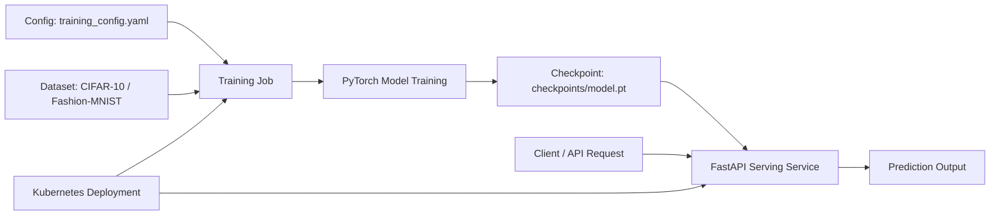

# MLOps PyTorch Pipeline

A small end-to-end machine learning pipeline for training and serving an image classifier on CIFAR-10 or Fashion-MNIST. The project demonstrates core MLOps principles: reproducible training, checkpoint artifact management, containerized serving, and Kubernetes deployment.

## Overview

This repository contains:

- a PyTorch training pipeline built in `src/train.py`
- a lightweight CNN or ResNet-18 model definition in `src/model.py`
- a FastAPI inference service in `src/serve.py`
- dataset loading and preprocessing in `src/dataset.py`
- config-driven training settings in `configs/training_config.yaml`
- Docker images for training and serving under `docker/`
- Kubernetes manifests in `k8s/`

## Architecture



## Project Structure

```text
mlops-pytorch-pipeline/
├── configs/
│   └── training_config.yaml
├── data/
│   └── cifar-10-batches-py/
├── checkpoints/
│   └── model.pt
├── docker/
│   ├── Dockerfile.train
│   ├── Dockerfile.serve
│   └── run_pipeline.sh
├── k8s/
│   ├── configmap.yaml
│   ├── hpa.yaml
│   ├── namespace.yaml
│   ├── serving-deployment.yaml
│   ├── serving-service.yaml
│   ├── training-job.yaml
│   └── training-pvc.yaml
├── e2e-validation/
│   └── run-pipeline-e2e.ps1
├── requirements/
│   ├── serve.txt
│   └── train.txt
├── src/
│   ├── dataset.py
│   ├── model.py
│   ├── serve.py
│   ├── train.py
├── tests/
│   └── test_model.py
├── README.md
└── .gitignore
```

## Prerequisites

Before running the project locally, install:

- Python 3.11+
- pip
- Docker (for containerized training and serving)
- Kubernetes tools (`kubectl`) for cluster deployment
- Git

## Local Setup

### 1. Clone and enter the repo

```bash
git clone <repo-url>
cd mlops-pytorch-pipeline
```

### 2. Create a virtual environment

```bash
python -m venv .venv
source .venv/bin/activate
# On Windows PowerShell:
# .\.venv\Scripts\Activate.ps1
```

### 3. Install dependencies

```bash
pip install -r requirements/train.txt
pip install -r requirements/serve.txt
```

### 4. Configure training

The default config is in `configs/training_config.yaml`.

Example settings:

```yaml
seed: 42

data:
  dataset_name: cifar10
  data_dir: ./data
  num_workers: 0
  download: true

model:
  architecture: simple_cnn
  num_classes: 10
  pretrained: false

training:
  epochs: 10
  batch_size: 64
  learning_rate: 0.001
  weight_decay: 0.0001
```

Supported datasets:

- `cifar10`
- `fashion_mnist`

Supported model architectures:

- `simple_cnn`
- `resnet18`

## Training

Run the training script from the project root:

```bash
python src/train.py --config configs/training_config.yaml
```

You can also override the config path with an environment variable:

```bash
export TRAIN_CONFIG=./configs/training_config.yaml
python src/train.py
```

On Windows PowerShell:

```powershell
$env:TRAIN_CONFIG = ".\configs\training_config.yaml"
python .\src\train.py
```

### What the trainer does

- loads the dataset and applies the necessary transforms
- builds the model based on `model.architecture`
- runs training and validation epochs
- saves the best checkpoint to `checkpoints/model.pt`
- prints JSON metrics for each epoch
- supports early stopping via the config

## Serving the Model

### Start the FastAPI server

```bash
export MODEL_CHECKPOINT_PATH=./checkpoints/model.pt
uvicorn src.serve:app --host 0.0.0.0 --port 8000
```

Or on Windows PowerShell:

```powershell
$env:MODEL_CHECKPOINT_PATH = ".\checkpoints\model.pt"
uvicorn src.serve:app --host 0.0.0.0 --port 8000
```

### Health check

```bash
curl http://localhost:8000/health
```

### Prediction request

```bash
curl -X POST http://localhost:8000/predict \
  -F "file=@path/to/image.jpg"
```

The API returns:

- predicted class name
- predicted class index
- probability distribution across all classes

## Docker Workflow

### Build the training image

```bash
docker build -f docker/Dockerfile.train -t mlops-train:v1 .
```

### Run training in Docker

```bash
docker run --rm \
  -v "$(pwd)/data:/app/data" \
  -v "$(pwd)/checkpoints:/app/checkpoints" \
  mlops-train:v1
```

### Build the serving image

```bash
docker build -f docker/Dockerfile.serve -t mlops-serve:v1 .
```

### Run the serving container

```bash
docker run --rm -p 8080:8080 \
  -v "$(pwd)/checkpoints:/app/checkpoints" \
  mlops-serve:v1
```

### Test the inference endpoint

```bash
curl -X POST http://localhost:8080/predict \
  -F "file=@test_image.png"
```

## Kubernetes Deployment

The repository includes manifests under `k8s/` for a simple training + serving workflow.

### Apply namespace and config

```bash
kubectl apply -f k8s/namespace.yaml
kubectl apply -f k8s/configmap.yaml
```

### Start the training job

```bash
kubectl apply -f k8s/training-job.yaml
```

### Deploy the serving app

```bash
kubectl apply -f k8s/serving-deployment.yaml
kubectl apply -f k8s/serving-service.yaml
kubectl apply -f k8s/hpa.yaml
```

### Verify the deployment

```bash
kubectl get pods -n ml-training
kubectl get svc -n ml-training
```

### Port-forward for local testing

```bash
kubectl port-forward svc/model-serving 8080:80 -n ml-training
curl -X POST http://localhost:8080/predict -F "file=@test_image.png"
```

## Testing

Run the unit tests:

```bash
pytest -q
```

## Notes

- The training config is the main control point for model selection and hyperparameters.
- Output checkpoints are saved under `checkpoints/` and later loaded by the serving service.
- The serving app expects a valid image file and uses the same preprocessing pipeline as training.
- This project is intentionally compact and designed to be easy to understand, extend, and deploy in a real ML workflow.

## Future Improvements

Possible extensions include:

- experiment tracking with MLflow or Weights & Biases
- model versioning and registry integration
- automated CI/CD pipelines
- model monitoring and drift detection
- load balancing and autoscaling improvements for production deployments

## License

This project is intended for educational and assignment purposes.
